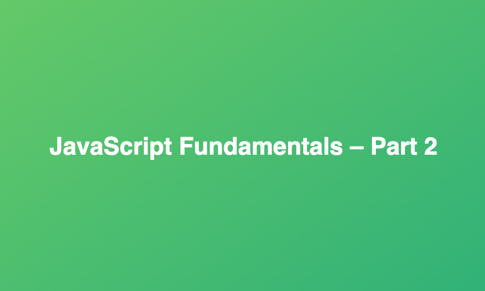

# Code Challenges for JavaScript Fundamentals - Part 2



## Welcome! 👋🏽

Here you will find the instructions for all the coding challenges for the `JavaScript Fundamentals Part 2` section of the Udemy course [The Complete JavaScript Course 2021: From Zero to Expert!](https://www.udemy.com/course/the-complete-javascript-course/), created by [Jonas Schmedtmann](https://www.udemy.com/user/jonasschmedtmann/).

Each coding challenge can be executed using the [index.html](./index.html) file in the [01-Fundamentals-Part-2](../01-Fundamentals-Part-2) directory.

The `<script>` line for each challenge has been included at the bottom of the `<body>` section of the `index.html` file so you will need to comment out the scripts that you don't need.

### Contents:

1. [Coding Challenge #1](#coding-challenge-1).
2. [Coding Challenge #2](#coding-challenge-2).

## Coding Challenge #1
[Back to top](#code-challenges-for-javascript-fundamentals---part-2)

Back to the two gymnastics teams, the Dolphins and the Koalas! There is a new gymnastics discipline, which works differently.

Each team competes 3 times, and then the average of the 3 scores is calculated (so one average score per team).

A team only wins if it has at least double the average score of the other team. Otherwise, no team wins!

### Your tasks:

1. Create an arrow function `calcAverage` to calculate the average of 3 scores.
2. Use the function to calculate the average for both teams.
3. Create a function `checkWinner` that takes the average score of each team as parameters (`avgDolhins` and `avgKoalas`), and then logs the winner to the console, together with the victory points, according to the rule above.

**Example**: 

```
"Koalas win (30 vs. 13)"
```

4. Use the `checkWinner` function to determine the winner for both **Data 1** and **Data 2**.
5. Ignore draws this time.

### Test data:

**DATA 1**: Dolphins score 44, 23 and 71. Koalas score 65, 54 and 49

**DATA 2**: Dolphins score 85, 54 and 41. Koalas score 23, 34 and 27

## Coding Challenge #2
[Back to top](#code-challenges-for-javascript-fundamentals---part-2)

Steven is still building his tip calculator, using the same rules as before: Tip 15% of the bill if the bill value is between 50 and 300, and if the value is different, the tip is 20%.

### Your tasks:

1. Write a function `calcTip` that takes any bill value as an input and returns the corresponding tip, calculated based on the rules above (you can check out the code from first tip calculator challenge if you need to). Use the function type you like the most. Test the function using a bill value of 100.
2. And now let's use arrays! So create an array `bills` containing the test data below.
3. Create an array `tips` containing the tip value for each bill, calculated from the function you created before.
4. **Bonus**: Create an array `total` containing the total values, so the bill + tip.

### Test data: 

```
125, 555 and 44
```