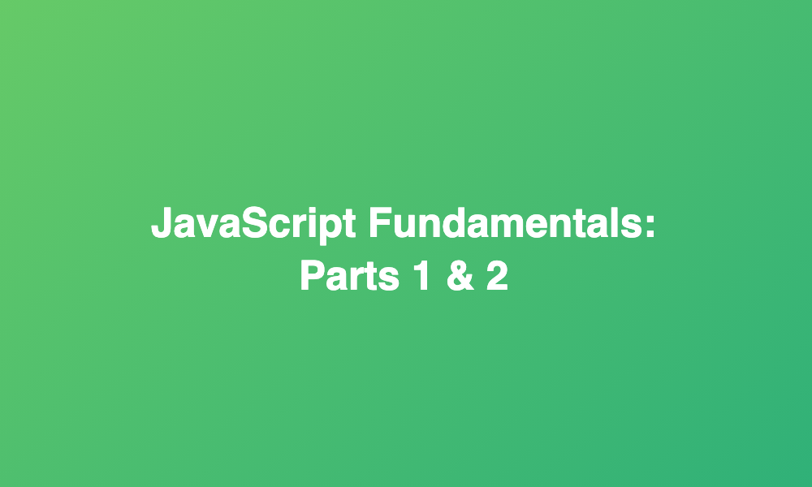

# JavaScript Fundamentals - Parts 1 & 2

## HI! 👋🏽

In this repository you will find basic JavaScript code written to complete the code challenges from the `JavaScript Fundamentals - Parts 1 & 2` sections of the Udemy course [The Complete JavaScript Course 2021: From Zero to Expert!](https://www.udemy.com/course/the-complete-javascript-course/), created by [Jonas Schmedtmann](https://www.udemy.com/user/jonasschmedtmann/).
