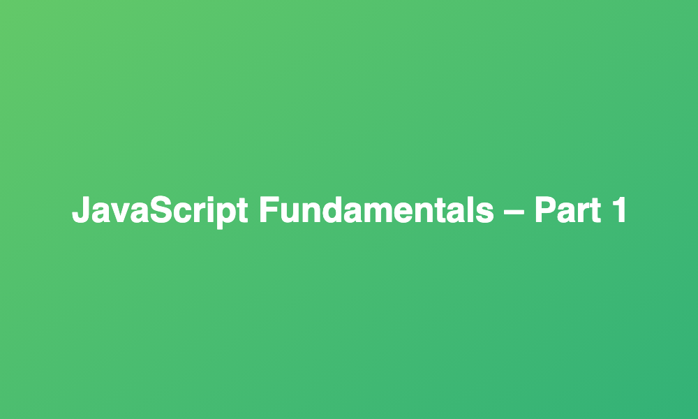

# JavaScript Fundamentals - Part 1

## HI! 👋🏽

In this repository you will find basic JS code written to complete the code challenges from the 'JavaScript Fundaments - Part 1' section of the Udemy course [The Complete JavaScript Course 2021: From Zero to Expert!](https://www.udemy.com/course/the-complete-javascript-course/), created by Jonas Schmedtmann.
